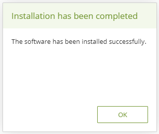
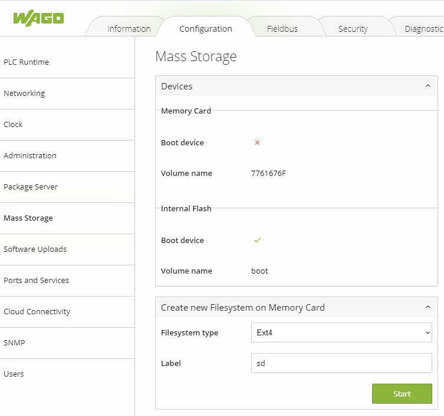
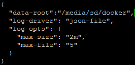

# docker-ipk
This repo contains static linked binaries of docker ce packed in linux ipk format.
Check Release tags to get the newest version.


# How to install Docker CE on Wago devices.

## Prerequisites for tutorial
- Wago PFC Generation 2 (e.g. 750-8212, 750-8213..)  or Wago Touch Panel 600 (e.g 0762-4104, 0762-4103..) with min. firmware 12 or higher installed in flash. 
    - for firmware download or update see: https://github.com/WAGO/pfc-firmware
- Wago <a href="https://github.com/WAGO/docker-ipk/releases" title="docker.ipk">docker.ipk</a>
- PC with preinstalled SSH Client (e.g. https://www.putty.org/)
- Web browser of your choice. (e.g. chrome).


## Installation

1. Start Wago PFC.
2. Open WBM (Web Base Management) menu "*Software Uploads*".

<div style="text-align: center">

</div>

3. Navigate to wago docker IPK. (e.g. docker_xx.xx.xx_armhf.ipk)
4. Then press "*Install*" button.
5. After finishing, you should see the success message.  
<div style="text-align: center">

</div>

6. Open menu "*Networking -> Routing*" and activate the IP Forwarding chekbox. (**Don't forget to press the Submit button!**)
<div style="text-align: center">

</div>

7. Restart the PFC (e.g. menu "*Administration -> Reboot*")


## PFC Login
Start SSH Client e.g. Putty 
 ```bash
login as `root`
password `wago`
 ```
## Check docker installation

```bash
docker info
docker ps # to see all running container (no container should run)
docker images # to see all preinstalled images
 ```
Enjoy the power of the whale!


# Move docker "DATA-ROOT" to the SD card.

Due to the lack of memory on the "home" partition it is interesting to move the docker "data-root" to an SD card.
This approach offers the following advantages: 
- positioning of more docker imgaes on the PFC. 
- any images / containers can be pre-installed by replacing the SD card.
- the physical portability of the images / containers increases.

## Migration of docker "data-root"

1. Insert any SD card into the WAGO device (preferably WAGO SD card)
2. Open WBM (Web Base Management) menu "*Mass Storage*".

<div style="text-align: center">

</div>

3. Select "Ext4" as file system type and assign a label for the SD partition (**in our case "sd"**). Then press the start button.

4. Stop running docker daemon.
     ```bash
          /etc/init.d/dockerd stop
     ```
2. Copy actual docker data root folder to sd card.
     ```bash
     cp -r /home/docker /media/sd/
     ```
 3. Edit daemon.json and change docker "data-root" entry. 
     ```bash
     vi /etc/docker/daemon.json or nano /etc/docker/daemon.json
     ```
<div style="text-align: center">

</div>

4. Start docker daemon.
     ```bash
     /etc/init.d/dockerd start
     ```
 5. Check docker functionality.

```bash
docker info
docker ps # to see all running container 
docker images # to see all preinstalled images
 ```

## Links
 1. <a href="https://www.wago.com/de/" title="wago">https://www.wago.com/de/</a>
 2. <a href="https://github.com/docker/docker-ce" title="docker ce">https://github.com/docker/docker-ce</a>

