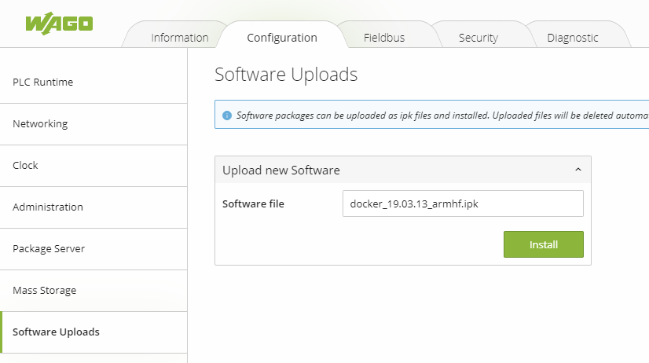

# docker-ipk
This repo contains static linked binaries of docker ce packed in linux ipk format.


# How to install Docker CE on Wago Device (PFC200 G2) 

## Prerequisites for tutorial
- Web browser of your choice. (e.g. chrome).
- Wago PFC with min. firmware 12 or higher instaled in flash. 
    - (for firmware update see https://www.youtube.com/watch?v=Ks1ak1zYVUg)
- Wago <a href="https://github.com/WAGO/docker-ipk/releases" title="docker_18.09.0_armhf.ipk">docker_18.09.0_armhf.ipk</a> (TODO add right link to github)
- PC with preinstalled SSH Client (e.g. https://www.putty.org/)


## Installation

1. Start PFC with FW12 and higher.
2. Open WBM (Web Base Management) menu "*Software Uploads*".

<div style="text-align: center">

</div>

3. Press "*Browse*" button and navigate to wago docker IPK. (e.g. docker_xx.xx.xx_armhf.ipk)
4. Then press "*Start Upload*" button.
5. After finishing the upload process, press "*Submit*" button to activate the software package. 
6. Just ignore possible error messages. 

<div style="text-align: center">

</div>

7. Open menu "*Networking -> Routing*" and activate the IP Forwarding chekbox. (**Don't forget to press the Submit button!**)
<div style="text-align: center">

</div>

8. Restart the PFC (e.g. menu "*Administration -> Reboot*")


## PFC Login
Start SSH Client e.g. Putty 
 ```bash
login as `root`
password `wago`
 ```
## Check docker installation

```bash
docker info
docker ps # to see all running container (no container should run)
docker images # to see all preinstalled images
 ```
## Links
 1. <a href="https://www.wago.com/de/" title="wago">https://www.wago.com/de/</a>
 2. <a href="https://github.com/docker/docker-ce" title="docker ce">https://github.com/docker/docker-ce</a>
 
Enjoy the power of the whale!
